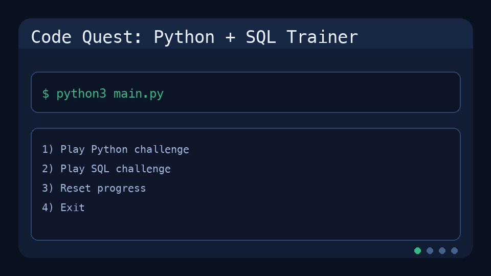

# Code Quest: Python + SQL Trainer

[](LICENSE)
[](https://www.python.org/)
[](.github/workflows/ci.yml)

Code Quest is a beginner-friendly command-line learning game for Python and SQL. It uses interactive challenges, instant feedback, and progress tracking to help users build practical coding and query skills.



## Why this project matters
- Demonstrates Python programming fundamentals (`dataclasses`, validation logic, file persistence).
- Demonstrates SQL competency using real query execution with SQLite.
- Shows product thinking: gamification, hinting, progression, and user feedback loops.
- Shows software engineering basics: tests, CI workflow, repo documentation, and MIT licensing.

## Role relevance (for hiring)
- Business Analyst: SQL filtering/aggregation patterns, data reasoning, and clear user flows.
- Data Scientist: data manipulation mindset, query literacy, and iterative problem solving.
- AI/ML Roles: core coding fluency, debugging discipline, and structured evaluation logic.

## Features
- Python challenge mode with retry + hint support.
- SQL challenge mode with executable queries against an in-memory SQLite dataset.
- Scoring system (+10 Python, +15 SQL) and unlocked progression.
- Local progress persistence in `progress.json`.
- Reset option for repeated practice.

## Tech stack
- Python 3
- SQLite (standard library `sqlite3`)
- JSON persistence
- GitHub Actions-ready CI configuration

## Quick start
```bash
cd "/Users/kyleparker/Documents/code game"
python3 main.py
```

## Example game loop
1. Pick Python or SQL challenge.
2. Submit answer or SQL query.
3. Receive immediate feedback (and hints if needed).
4. Earn points and continue to the next level.

## Repository structure
- `main.py` - menu and game loop.
- `game.py` - challenge logic, scoring, SQLite setup, persistence.
- `tests/test_game.py` - unit tests for core behavior.
- `.github/workflows/ci.yml` - automated test run on push/PR.

## Suggested GitHub "About" settings
- Description: Beginner-friendly Python + SQL learning game with interactive challenges, hints, and progress tracking.
- Website: <YOUR_PORTFOLIO_OR_LINKEDIN_URL>
- Topics: `python`, `sql`, `sqlite`, `business-analyst`, `data-science`, `ai-learning`, `education`, `cli-game`

## Portfolio talking points
- Built an educational CLI product that maps technical exercises to measurable progression.
- Designed challenge validation logic for both Python and SQL with constrained retries and hints.
- Added test coverage and CI to keep behavior reliable as feature scope grows.
- Documented recruiter-discovery steps in [CAREER_VISIBILITY.md](CAREER_VISIBILITY.md).

## Roadmap
- Add intermediate and advanced challenge packs.
- Add analytics export (CSV) for learner performance tracking.
- Add optional web UI (Streamlit or Flask).
- Add LLM-assisted hints for dynamic coaching.

## License
This project is licensed under the MIT License. See the [LICENSE](LICENSE) file.
